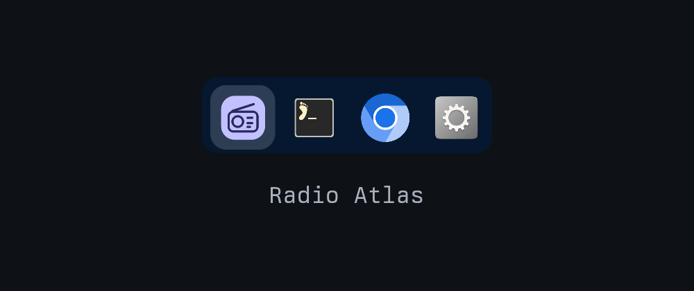

# Alt-tab switcher (macOS-style bar)

An `ALT`+`TAB` switcher for [Omarchy](https://omarchy.org/) with two
appearances. Cycles every window on every workspace, ordered by most recently
used.

- **`list`** (default) — the original list card: workspace number, icon, app
  name, and window title per row. This is exactly the upstream appearance.
- **`bar`** — a macOS-style horizontal bar of window icons with the selected
  window's title beneath it.

Hold `ALT`, tap `TAB` to move through the list or bar, release `ALT` to jump to
the highlighted window.



> **This is a fork.** It is based on Pablo Merino's
> [omarchy-altswitch](https://github.com/Pablo-Merino/omarchy-altswitch) 1.0.0
> (MIT). Key handling, state, and IPC are unchanged; this fork adds an opt-in
> icon-bar appearance and a configurable icon override. See [NOTICE](NOTICE) and
> [CHANGELOG](CHANGELOG.md). Not affiliated with or endorsed by the original
> author.

## Behaviour

| Keys | Action |
| --- | --- |
| `ALT`+`TAB` | Open the switcher and select the previous window |
| `ALT`+`TAB` again, `ALT` still held | Move one further along the list |
| `ALT`+`SHIFT`+`TAB` | Move back |
| Release `ALT` | Switch to the highlighted window |
| `ALT`+`ESCAPE` | Cancel without switching |

Two things make this behave like Windows rather than like Hyprland's
`cyclenext`:

- The window list is snapshotted when the switch starts and then frozen, so the
  order cannot shuffle underneath you while you tab through it.
- Selection is virtual. Focus moves once, when you release `ALT`. Focusing on
  every tap would drag you across workspaces on the way past.

Special and scratchpad workspaces are excluded. Every monitor is included.

## Requirements

- Omarchy Quattro, for the shell plugin system
- Hyprland 0.56 or newer, configured in Lua

No other dependencies, and nothing to install beyond this repository.

## Install

Add the plugin and enable it:

```bash
omarchy plugin add https://github.com/putueddy/omarchy-altswitch.git --enable
```

Then load the keybindings from `~/.config/hypr/bindings.lua`:

```lua
dofile(os.getenv("HOME") .. "/.config/omarchy/plugins/putueddy.altswitch/altswitch.lua")
```

Apply it with `hyprctl reload`.

That line replaces Omarchy's four default `ALT`+`TAB` bindings (`cyclenext` and
`bring_to_top`, in both directions). It unbinds them itself, so no other edit is
needed.

> Do **not** enable this fork at the same time as the original
> `io.github.pablo-merino.altswitch`: both register the `altswitch` IPC target,
> so only the first one loaded would respond.

## Settings

### `style`

Choose the appearance. Defaults to `list`.

```bash
omarchy-shell altswitch set style bar    # macOS-style icon bar
omarchy-shell altswitch set style list   # original list card
```

The equivalent manual setting is the plugin's entry in
`~/.config/omarchy/shell.json`:

```json
{ "id": "putueddy.altswitch", "style": "bar" }
```

### `iconOverrides`

Icons are resolved from the window class through the desktop entries. When a
window has no desktop entry, or resolves to the wrong icon, map it here. Each
entry matches `appClass` exactly and, optionally, the window `title` exactly.

```bash
omarchy-shell altswitch set iconOverrides \
  '[{"appClass":"org.quickshell","title":"Radio Atlas","icon":"~/.config/quickshell/radio-atlas/radio.svg"}]'
```

`icon` accepts a theme icon name, an absolute path, a `~/` path, or a
`file://` URL.

```json
{
  "id": "putueddy.altswitch",
  "iconOverrides": [
    {
      "appClass": "org.quickshell",
      "title": "Radio Atlas",
      "icon": "~/.config/quickshell/radio-atlas/radio.svg"
    }
  ]
}
```

A window that matches no override falls back to its desktop entry, then to the
generic executable icon.

### `showIcons`

In `list` style, hide the per-row application icons:

```bash
omarchy-shell altswitch set showIcons false
```

`showIcons` has no effect in `bar` style, which is icon-only.

## Remove

Delete the `dofile` line from `~/.config/hypr/bindings.lua`, then:

```bash
hyprctl reload
omarchy plugin remove putueddy.altswitch
```

Omarchy's default `ALT`+`TAB` bindings come back on the next reload.

## How it works

The plugin is two halves that talk over Omarchy's shell IPC.

`altswitch.lua` runs inside Hyprland and owns all state and all keys. It reads
the window list from `hl.get_windows()`, sorted by Hyprland's own
`focus_history_id`, and drives the panel with `omarchy-shell altswitch
show|select|hide`.

`AltSwitch.qml` runs inside `omarchy-shell` and draws the panel in the selected
style. It takes no keyboard focus, so it cannot trap your keyboard, and it hides
itself after ten seconds if an `ALT` release is ever missed.

Two Hyprland details are worth knowing if you plan to modify this:

- Committing on `ALT` release cannot be a keybind. A release bind on a modifier
  only fires when that modifier is tapped alone; pressing `TAB` in between
  cancels it. The raw `input.keyboard.key` event stream is read instead.
- Focusing a window from inside a key callback updates Hyprland's active window
  but does not settle until the next input event, so the focus dispatch is sent
  through `hyprctl` from outside that callback.

## Known limitations

- Keys that the switcher does not bind still reach the window underneath while
  the switcher is open. Blocking them needs an exclusive keyboard grab, which
  risks trapping the keyboard if a switch is ever left open.
- There are no window thumbnails.
- The `bar` style shows icons only; app names and workspace numbers are not
  drawn.

## Credits & license

Original plugin: [Pablo Merino](https://github.com/Pablo-Merino) —
`omarchy-altswitch`, MIT. The `bar` style is adapted from a local Caelestia
rework of the same plugin.

[MIT](LICENSE) © 2026 Pablo Merino and putueddy.
